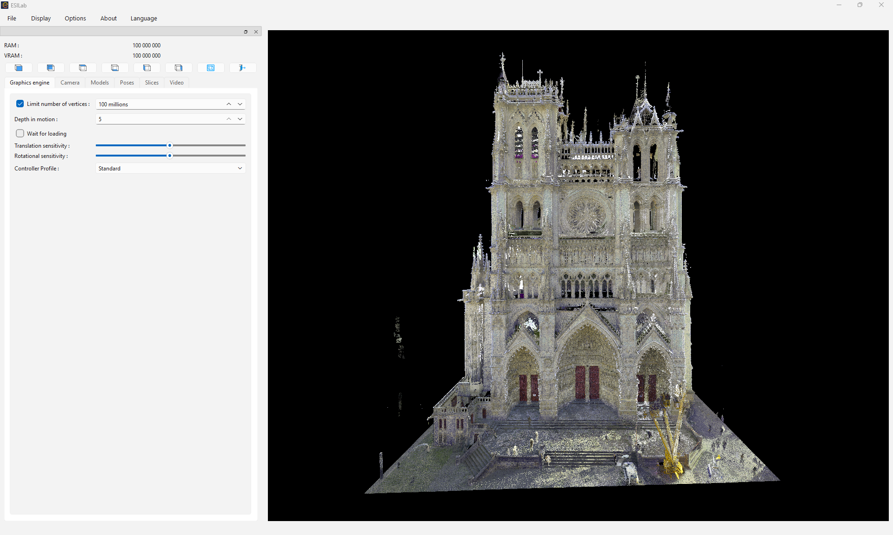

# ESILab
🇫🇷 English version: [README.md](README.md)

ESILab permet de visualiser et de naviguer dans des nuages comprenant un très grand nombre de points.
Le logiciel se base sur des nuages de points au format **OCTI**. Format obtenu à partir de fichiers **PTS** et de l'outil de conversion [3DModelConverter](https://github.com/PerceptionRobotique/3DModelConverter).

## ⚙️ Installation Windows

1. Télécharger [`ESILab_Setup.exe`](https://github.com/PerceptionRobotique/ESILAB/releases/latest/download/Esilab_Setup.exe)
2. Lancer l’installateur depuis le dossier Téléchargements  
   - Si un avertissement de sécurité Windows apparaît, cliquer sur **“Plus d’informations”**, puis **“Exécuter quand même”**
3. Suivre l’assistant d’installation

## 🚀 Utilisation

1. Cliquer sur **File/Open Model** et sélectionner un fichier **OCTI**. Veiller à ce que le fichier **`name`_LO.txt** soit dans le même dossier que le fichier **`name`.octi** et que leurs noms **`name`** soient les mêmes.
2. Utiliser les fonctionnalités d'ESILab pour naviguer dans le nuage de points, enregistrer des images, créer des coupes, générer des vidéos, etc... 

Consulter la [documentation complète](docs/ESILab_doc.pdf).

Télécharger des exemples de [`dossiers OCTI`](https://extra.u-picardie.fr/nextcloud/index.php/s/ZPgQs8JKQ7mDKPC).

## ℹ️ À propos

ESILab est développé par le **Laboratoire MIS (Modélisation, Information & Systèmes)**  
de l’**UPJV (Université de Picardie Jules Verne)**.

👉 https://www.mis.u-picardie.fr/

## 🛠️ Support & maintenance

Pour toute demande de support technique, veuillez contacter :  
📧 esilab@u-picardie.fr

## 📦 Versions

👉 [Voir toutes les versions](https://github.com/PerceptionRobotique/ESILab/releases)